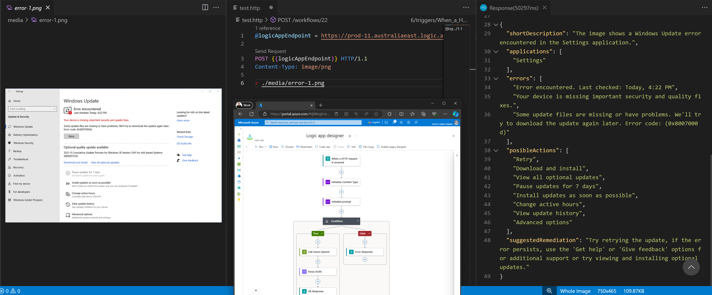

# LogicAppGPTVision
A small demo showing an approach to using a Logic App to transform a screenshot into structured data using GPT-4 Vision on Azure OpenAI

## One-Click Deploy - Logic App Consumption

